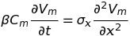
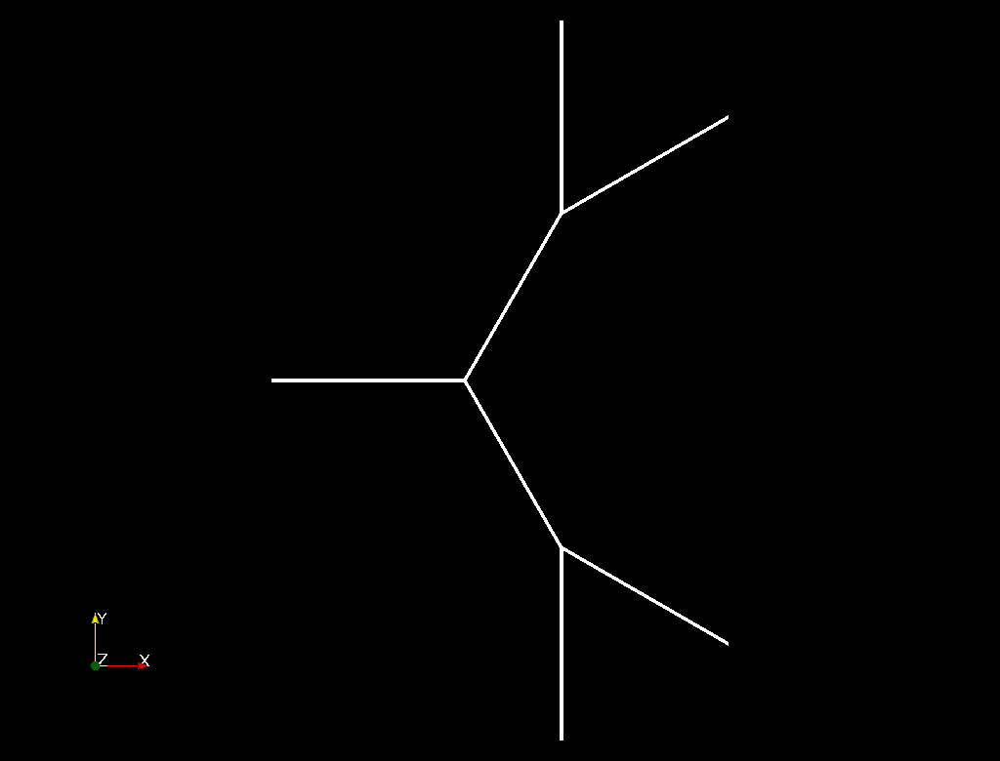
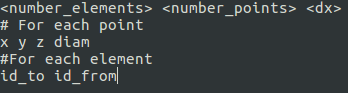

# Purkinje-Microscopic-MVF

Solve the monodomain equation using Finite Volume Method. 



The project is divided in 4 parts.

- Skeleton_Mesh
- Mesh_Generator
- Pk-Noble
- Pk-LiRudy

# Skeleton_Mesh

- Build the skeleton for the network mesh.
- The output file is using the .vtk extension.
- To visualize the structure open the output file using Paraview
- There are 3 types of network that could be generated:
  - Fiber with a bifurcation at the endpoints (Type 1);
  - Fiber with iterative growth (Type 2);
  - Fiber with iterative growth and angle control (Type 3). 
- For the Type 2 and 3 network the maximum number of iterations and angle control can be adjusted by the variables MAX_ITER and ANG, respectly.

Build and execute

```sh
$ make
$ ./skeletonMesh <xMax> <biff> <type> <out_VTK_file>
```

Example
```sh
$ ./skeletonMesh 1.0 2 3 example.vtk
```
This example will build a network of type 3 with two segments leaving each bifurcation and a fiber length of 1cm.



# Mesh_Generator

  - Build the mesh network that will be used to solve FVM.
  - INPUT: network generated by the SkeletonMesh program must be provided.
  - INPUT: type of the cell that make up the fiber
    - pig = 68 um
    - dog = 164 um
    - test1 = 75 um
    - test2 = 100 um
    - test3 = 125 um
    - test4 = 150 um
    - test5 = 175 um
    - test6 = 200 um
  - The output file must defined with the extension ".msh".
  - The syntax of the ".msh" file is defined as



Build and execute
```sh
$ make
$ ./meshGenerator example.vtk example.msh
```
